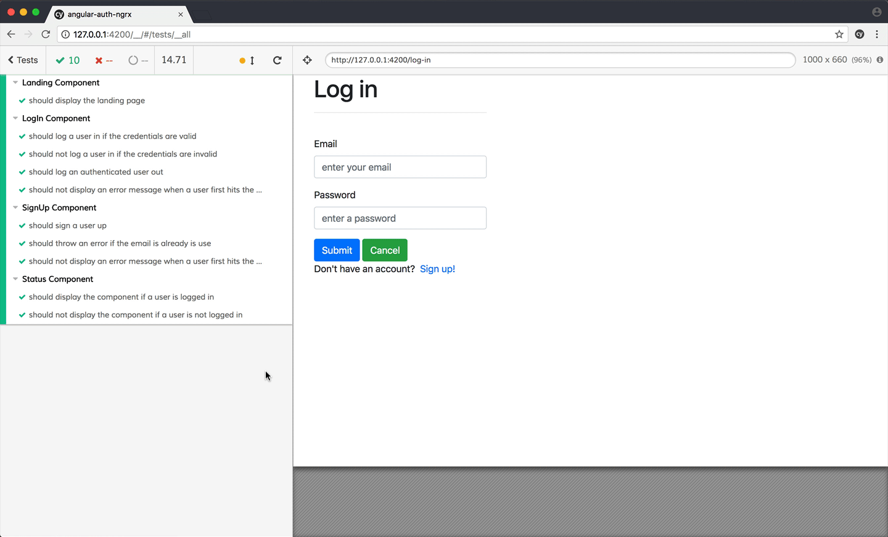

# Testes E2E (End to End)

## O que é?

Testes End-to-End verificam a aplicação como um todo, simulando interações reais do usuário. No Angular, o **Cypress** é uma alternativa moderna e amigável ao Protractor.

### Fonte

Para saber mais, acesse [Cypress](https://docs.cypress.io/app/get-started/why-cypress).

## Instalação do Cypress

- Adicione o Cypress ao projeto Angular

  ```bash
  npm install cypress --save-dev
  ```

- Configure o Cypress

  Adicione o script no `package.json`:

  ```json
  "scripts": {
    "cypress:open": "cypress open"
  }
  ```

### Estrutura Básica de Teste com Cypress

```jsx
describe("Página Inicial", () => {
  it("Deve exibir o título", () => {
    cy.visit("/");
    cy.contains("Bem-vindo ao Angular").should("be.visible");
  });
});
```

## Exemplos Práticos de Testes E2E

### Teste de Formulário

```html
<form>
  <input id="nome" placeholder="Nome" />
  <button id="enviar">Enviar</button>
</form>
```

```jsx
describe("Formulário", () => {
  it("Deve preencher e enviar o formulário", () => {
    cy.visit("/");
    cy.get("#nome").type("João");
    cy.get("#enviar").click();
  });
});
```

### Teste de Navegação

```jsx
describe("Navegação", () => {
  it("Deve navegar para a página Sobre", () => {
    cy.visit("/");
    cy.get('a[href="/sobre"]').click();
    cy.url().should("include", "/sobre");
  });
});
```

### Mock de APIs

```jsx
describe("Mock de API", () => {
  it("Deve exibir dados mockados", () => {
    cy.intercept("GET", "/api/dados", { dados: ["item1", "item2"] });
    cy.visit("/");
    cy.get(".lista").should("contain", "item1");
  });
});
```

## Execute os Testes

Para acompanhar os testes do cypress, deve-se rodar o projeto localmente e executar o cypress. Feito isso, o cypress abrirá sua interface com os testes criados para ser testados.

- Rode o projeto local

  ```bash
  npm start
  ```

- Execute o comando do cypress

  ```bash
  npm run cypress:open
  ```

  

## Boas Práticas

- **Use Seletores Únicos**

  Evite selecionar elementos por texto visível. Prefira IDs ou classes específicas.

- **Teste Fluxos Críticos**

  Concentre-se nos caminhos principais que os usuários seguem.

- **Simule APIs**

  Use mocks para evitar dependências externas.
